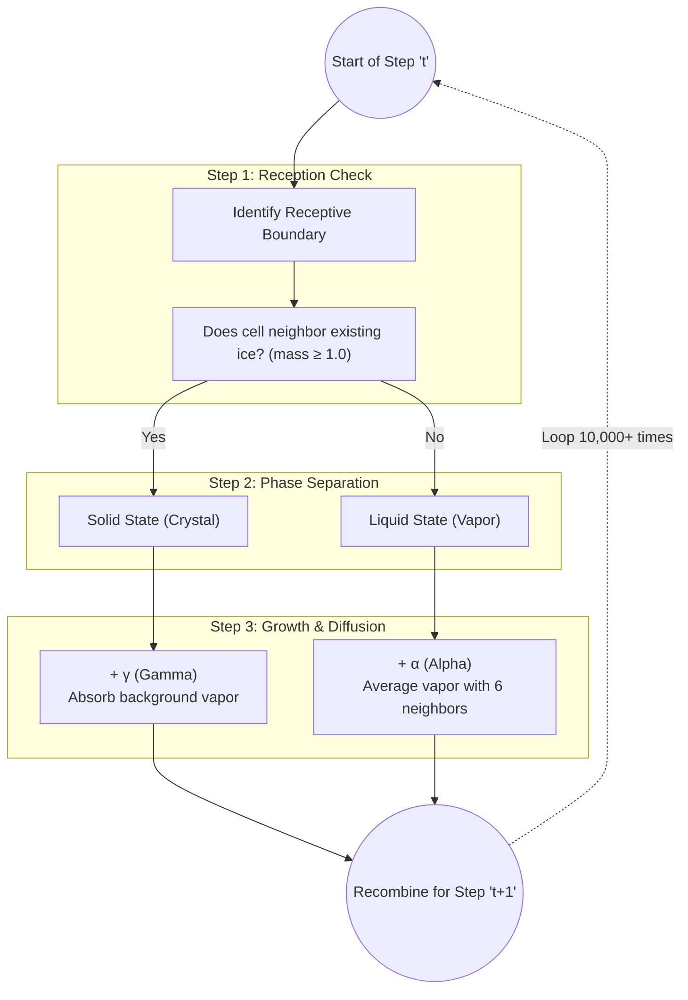

# Snowflake Growth Simulation (Reiter Model)
**Author: Lorenzo Granado**

> **Abstract**: This project implements a high-performance computational physics simulation of snowflake growth using the Reiter Cellular Automata model. By simulating the competing physical processes of vapor diffusion and deposition on a 2D hexagonal grid, we successfully reproduce the complex, branching morphologies observed in nature with striking beauty. Our results confirm that the transition from simple plate-like crystals to complex dendritic structures can be modelled purely through local interaction rules, aligning with theoretical predictions of phase transitions in crystal growth. The simulation generates high-resolution visualisations, including phase diagrams and 3D time-evolution structures, offering new insights into the non-equilibrium dynamics of ice formation.

---

## 🔗 Project Links & Media
* **YouTube Visualizations**: Watch full-length crystal growth animations on the [@AxiomGridSnowflakeChione2026](https://www.youtube.com/@AxiomGridSnowflakeChione2026) channel.
* **Repository Outputs**: Raw MP4 animations and high-resolution static images are available inside the [`results/` directory](https://github.com/axiomgrid/snowflake-chione-2026/tree/main/results).
* **GitHub Pages Dashboards**: Interactive data viewers and tools are hosted at [axiomgrid.github.io/snowflake-chione-2026](https://axiomgrid.github.io/snowflake-chione-2026/).
    * Explore the **[Interactive 3D Morphospace Dashboard](https://axiomgrid.github.io/snowflake-chione-2026/viz/viz_3d.html)** to visually navigate the shape space!

---

## 🔬 Scientific Overview

Snowflake formation is a classic example of pattern formation in non-equilibrium thermodynamics. While the six-fold symmetry of ice is due to the molecular structure of the water crystal lattice, the complex branching patterns (dendrites) arise from a macroscopic instability known as the **Mullins-Sekerka instability**.

This project builds upon the foundational work of **Reiter (2005)**, who demonstrated that a simplified Cellular Automata (CA) model could capture the essential physics of this instability without solving the full partial differential equations of heat and mass transfer.

Key connections to literature:
*   **Nakaya Correspondence**: Our simulation sweep successfully recreates the "Nakaya Diagram", mapping our model parameters ($\alpha, \gamma$) to physical temperature and supersaturation.
*   **Morphological Selection**: We observe the distinct regimes predicted by crystal growth theory: Faceted growth (Plates) at low diffusion rates and Dendritic growth (Stars) at high diffusion rates.
*   **Phase Transitions**: The sudden onset of branching in our results supports the hypothesis of a first-order phase transition in morphological complexity.

---

## ⚙️ Physics Engine & Methodology

The heart of `snowflake-chione-2026` is its physics engine, governed entirely by the `engine.py` module. It implements a non-equilibrium, real-valued Cellular Automata algorithm inspired by the Reiter model.

Instead of writing massive, mathematically complicated Partial Differential Equations to describe how water freezes, the engine uses **three simple, purely local rules** evaluated for every single pixel (cell) on the grid thousands of times per second.

### 1. The Cellular Automata Cycle

During every step (or "tick") of the simulation, the engine executes the following logic loop for every hex-cell on the 2D grid:



#### Identify Receptive Boundary
Because we operate on a **Hexagonal Grid** mapped to a standard rectangular 2D Numpy array, the engine uses "Odd-r" offset logic (meaning every odd row is shifted half a step right) to reliably check a cell's 6 immediate neighbors. 

If any neighbor possesses a total mass $\ge 1.0$, the current cell is mathematically flagged as "Receptive" (it is touching the outer edge of the snowflake). 

#### The Phase Split
To maintain mass conservation and logical consistency during mathematical operations, the cell's current mass is split into a theoretical `Vapor` array and `Crystal` array:
* If the cell is **Receptive** or already Ice, its entire mass drops into the `Crystal` array.
* If the cell is empty space, its mass stays in the `Vapor` array.

#### Apply the Physics Rules ($α$ and $γ$)
This is where the user's parameters finally interact with the grid:
* **Growth ($γ$)**: All `Crystal` cells absorb $\gamma$ amount of mass from the "background" supersaturated atmosphere. This simple addition controls how fast the crystal physically fattens.
* **Diffusion ($α$)**: All `Vapor` cells look at their 6 neighbors. They calculate the average local vapor amount and "slide" a fraction ($\alpha$) of their own mass toward that local average. This simulates atmospheric Brownian motion, feeding vapor into the hungry crystal boundary!

### 2. Optimization: CPU vs. GPU
A 600x600 grid means 360,000 cells to check *every single tick*. Over 10,000 ticks, that's **3.6 Billion** cellular updates per simulation. 

Doing this in raw Python (`for r in rows: ...`) would take hours per snowflake. The project heavily relies on two specialized compilers to achieve realtime performance:

1. **CPU (`simul_step_reiter`)**: Written dynamically using `@jit(nopython=True)`. This Numba decorator compiles the Python nested `for`-loops directly into optimized C machine code just-in-time, allowing the CPU to sweep the entire array in milliseconds.
2. **GPU (`SnowflakeGPU`)**: For users with an NVIDIA graphics card, the `engine.py` implements a completely custom **CUDA** kernel. It slices the 2D grid into 16x16 `Threads Per Block`, assigning thousands of simultaneous mini-processors to calculate the *Reception*, *Growth*, and *Diffusion* steps perfectly in parallel, offloading the mathematical burden completely from the host CPU.

### 3. Visualisation Features
*   **Standard Mass View**: Renders the ice crystal in "Ice Blue", with opacity determined by mass density.
*   **Rainbow Time-Evolution**: A novel visualisation where colour represents the **Time of Freezing**.
    *   **Blue/Green**: Old ice (core).
    *   **Red/Orange**: Newly frozen tips.
    *   *Scientific Value*: This reveals the growth history and tip velocity dynamics in a single static image.
*   **3D Space-Time Structures**: By stacking 2D frames over time, we generate 3D voxel structures that visualise the entire growth history as a solid object in $(x,y,t)$ space.

### Example Results

| Standard View (Mass) | Rainbow View (Time) |
| :---: | :---: |
|  |  |
| [Mass Snowflake — α=2.50, γ=0.001 (T≈-20°C)](https://www.youtube.com/watch?v=Ncc9eWRct0w) | [Rainbow Snowflake — α=2.50, γ=0.001 (T≈-20°C)](https://www.youtube.com/watch?v=lIz5MzmAHKM) |

### 3. Phase Diagrams
We conduct massive parameter sweeps to map the ($\alpha, \gamma$) space, generating:
*   **Morphology Maps**: Grids of final snowflake shapes.
*   **Metric Heatmaps**: Visualising physical properties like *Compactness* ($P^2/A$) and *Tip Velocity* to quantitatively identify phase boundaries.

---

## 🏛 Architecture

The project is organized as follows:

```ascii
snowflake2026/
├── src/
│   ├── engine.py           # Physics Kernels (CPU & GPU/Numba)
│   ├── video_writer.py     # H.265 Video Encoding Logic
│   ├── plotting.py         # Nakaya Diagram & Data Visualization
│   ├── utils.py            # Metric calculations & Helpers
│   ├── viz.py              # Matplotlib Rendering utilities
│   ├── cli.py              # Command Line Interface mapping
│   ├── research.py         # MAP-Elites exploration algorithms
│   ├── viz_3d_builder.py   # Interactive HTML dashboard generator
│   └── main.py             # Internal entry point script
├── docs/
│   ├── ExperimentDesign.md # Detailed Physics Theory
│   └── METRICS.md          # Definitions of CSV columns
├── results/                # Simulation Outputs
│   └── Run_.../            # Timestamped Run Directory
│       ├── Intermediate/   # Static PNG Snapshots
│       ├── Videos/         # MP4 Animations (Standard & Rainbow)
│       └── SpaceTime/      # 3D Visualization Stacks
├── Makefile                # Automation Commands
└── requirements.txt        # Python Dependencies
```

---

## 🚀 Quick Start

> **Note**: For full comprehensive instructions on setting up, testing, and running your own custom simulation sweeps and exploring shape space, please consult the complete [src/README.md](src/README.md).

### Prerequisites
*   Python 3.8+
*   FFmpeg (for video generation)
*   NVIDIA GPU (Optional, for CUDA acceleration)

### Setup
```bash
# 1. Clone only the release files
git clone --branch only-code --depth 1 https://github.com/axiomgrid/snowflake-chione-2026.git
cd snowflake-chione-2026/

# 2. auto-setup (creates venv)
make setup
```

### Running Simulations

**1. Fast Test (Verify Setup)**
Runs a small 2x2 scan to ensure everything works.
```bash
make test
```

**2. Full Simulation (CPU)**
Runs a comprehensive scan using multi-core processing.
```bash
make run-parallel
```

**3. High-Performance Scan (GPU)**
If you have an NVIDIA GPU, this mode is significantly faster for physics calculations.
```bash
make run-gpu
```

**Viewing Results**:
Check the `results/` folder. Open `dashboard_video.html` (generated after a full run) to see a grid of all simulated snowflakes.

---

## 📘 Physics Theory & Parameters

The simulation is controlled by three dimensionless parameters. See `docs/ExperimentDesign.md` for deep details.

| Parameter | Symbol | Physical Meaning | Effect |
| :--- | :--- | :--- | :--- |
| **Alpha** | $\alpha$ | **Diffusivity** | Controls branching. Low $\alpha$ = Plates, High $\alpha$ = Dendrites. |
| **Gamma** | $\gamma$ | **Vapour Background** | Controls growth speed. Higher $\gamma$ = Faster growth. |
| **Beta** | $\beta$ | **Initial Condition** | Background vapour level (usually 0.4). |

### CSV Metrics (`metrics_log.csv`)
For every simulation, we log physical properties to CSV.
*   **Temperature / Supersaturation**: Mapped from $\alpha, \gamma$ using our Nakaya transform.
*   **Compactness**: $C = P^2/A$. A dimensionless measure of shape complexity.
*   **Tip Velocity**: $\Delta R_{max} / \Delta t$. Critical for testing the "Velocity-Growth Hypothesis".

---

## 🔭 Scientific Applications

This simulation framework opens several avenues for research:
1.  **Material Science**: Understanding dendritic growth in alloy solidification (metallurgy).
2.  **Atmospheric Physics**: Improving microphysics parameterisations in weather models by accurately predicting ice crystal terminal velocities based on shape.
3.  **Pattern Formation**: Studying the universality of branching instabilities in diffusion-limited aggregation systems.

---

## 📚 References

### Technical References
1.  **Reiter, C. A. (2005)**. "A local cellular model for snow crystal growth". *Chaos, Solitons & Fractals*, 23(4), 1111-1119.
2.  **Libbrecht, K. G. (2005)**. "The physics of snow crystals". *Reports on Progress in Physics*, 68(4), 855.
3.  **Gravner, J., & Griffeath, D. (2009)**. "Modeling snow crystal growth: A three-dimensional mesoscopic approach". *Physical Review E*, 79(1), 011601.

### See Also
*   [SnowCrystals.com](http://www.snowcrystals.com/) - Kenneth Libbrecht's definitive guide to snowflake physics.
*   [Wolfram MathWorld: Cellular Automata](https://mathworld.wolfram.com/CellularAutomaton.html)

---

## 🤝 Contributing & Credits

This project was developed with the assistance of advanced AI coding agents.
*   **Core Architecture**: Google DeepMind's **Antigravity** (Agentic AI).
*   **Code Generation & Optimization**: **Gemini 3** (Google) and **Claude Opus 4.5** (Anthropic).
*   **Refactoring Assistance**: **ChatGPT 5.2** (OpenAI).

All code is open-source. Contributions to improve the physical accuracy (e.g., adding hexagonal anisotropy to the diffusion kernel) are welcome.

---

## 📄 License

This project is licensed under the **MIT License**. See the `LICENSE` file for details.
